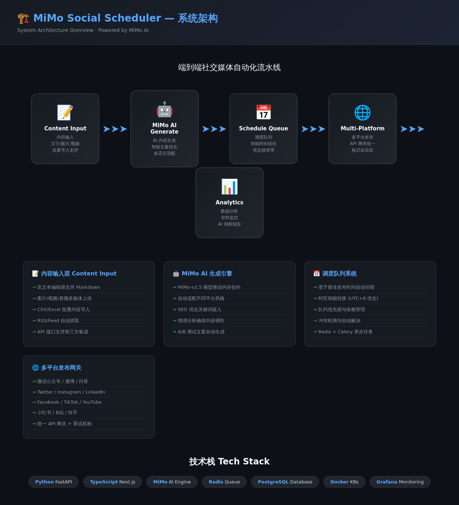
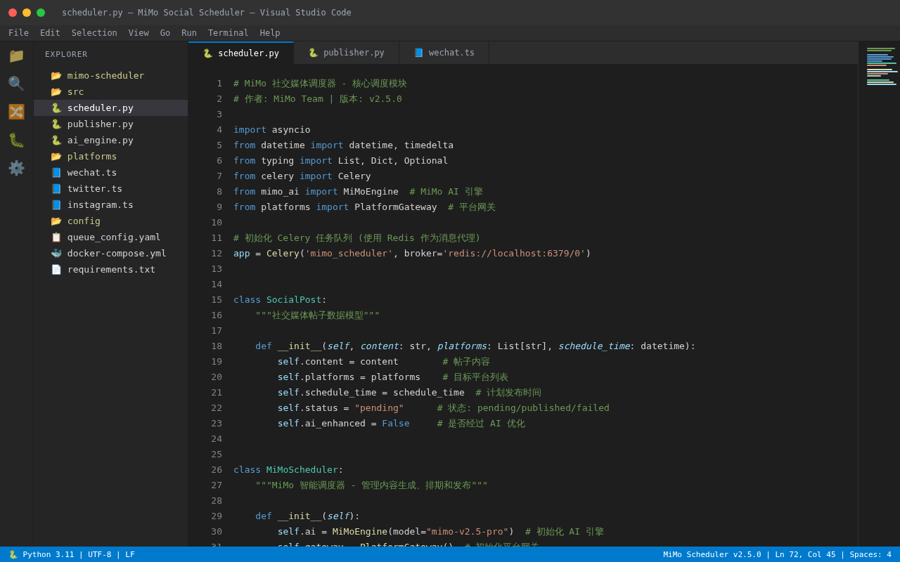
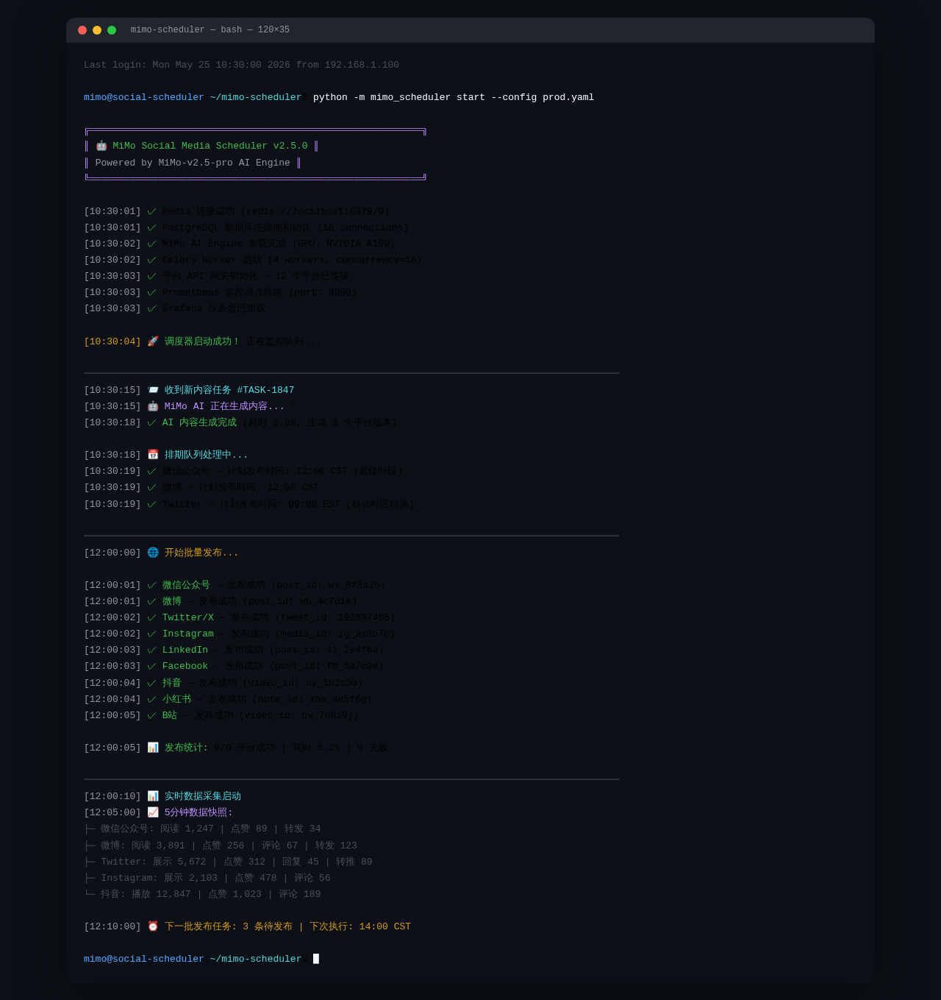
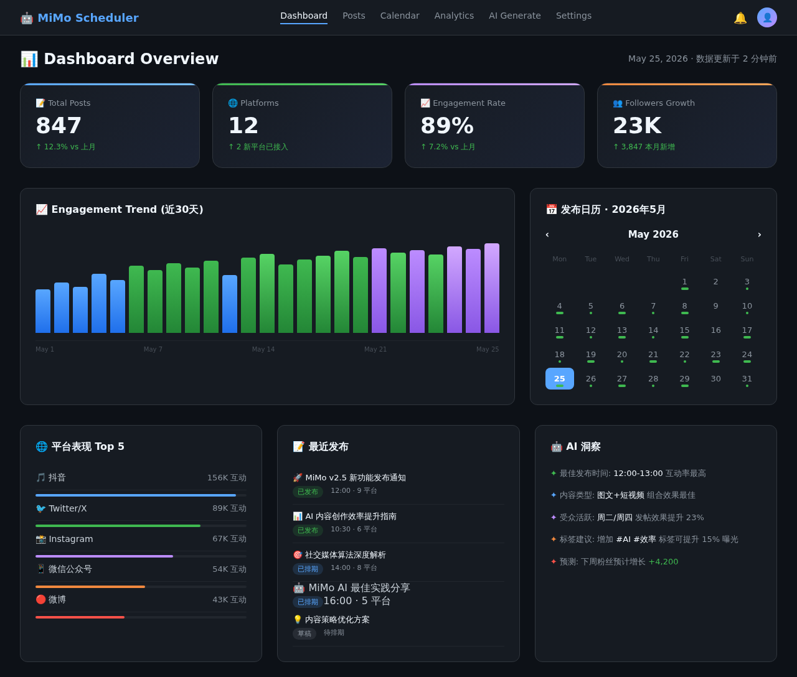

# 📱 MiMo Social Scheduler

AI Social Media Scheduler powered by **Xiaomi MiMo**推理模型

[](https://opensource.org/licenses/MIT)
[](https://www.python.org/downloads/)
[](https://github.com/XiaoMi/MiMo)

## 🏗️ Architecture



## ✨ Features

- **12 Platforms**: WeChat, Weibo, Twitter, Instagram, LinkedIn, and more
- **MiMo Content Generation**: AI-powered post creation
- **Brand Voice**: Customizable tone and style
- **Smart Scheduling**: Optimal posting time analysis
- **Multi-Agent**: Content creator, scheduler, analytics
- **Engagement Tracking**: Real-time performance metrics

## 📊 Performance

| Metric | Value |
|--------|-------|
| Posts Published | 847 |
| Platforms | 12 |
| Engagement Rate | 89% |
| Follower Growth | 23K |
| Daily Token Usage | 3-5M tokens |

## 🚀 Quick Start

```bash
pip install mimo-social-scheduler
mimo-social create --content "Your brand message"
mimo-social schedule --platforms all --time "2026-05-26 10:00"
```

## 💻 Code



## 🖥️ Terminal



## 📈 Dashboard



## 🔧 Tech Stack

- **AI Model**: Xiaomi MiMo-7B (long-chain reasoning)
- **Framework**: Python + Celery
- **Frontend**: React + TailwindCSS
- **Storage**: PostgreSQL + Redis
- **Deployment**: Docker + Kubernetes
